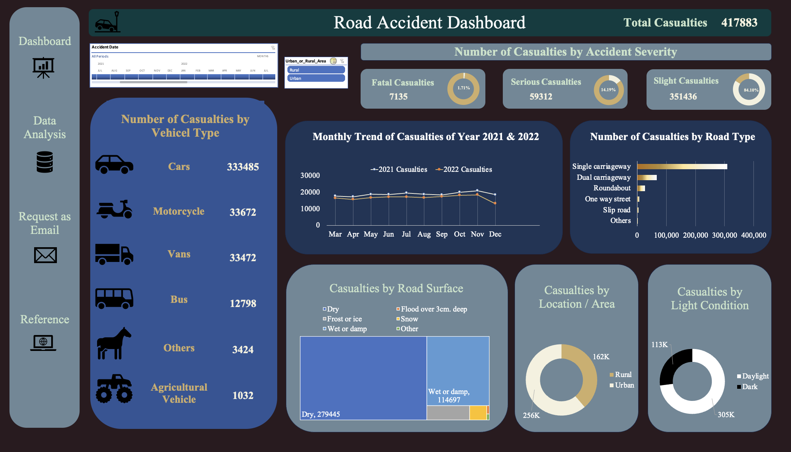

# Analyze Road Accident Data in Excel

This is an Excel Project analyzing Road Accident Data by building up an interactive dashboard.



[](LICENSE)
[](https://github.com/christinazyn/excel-project-coffee-sales/stargazers)
[](https://github.com/christinazyn/excel-project-coffee-sales/network/members)
[](https://github.com/christinazyn/excel-project-coffee-sales/issues)
[](https://github.com/christinazyn/excel-project-coffee-sales/pulls)

## Table of Contents

- [Demo](#demo)
- [Data](#data)
- [Requirements](#requirements)
- [Steps](#steps)
- [Contributing](#contributing)
- [Acknowledgments](#acknowledgments)

## Demo

[Demo Link](https://1drv.ms/x/s!AtS71s00CmdLgQRhP7BPDLSjXRta)

## Data

The dataset comes from [Kaggle](https://www.kaggle.com/datasets/syedibrahim03/road-accidents-dataset). It comprises road accident data of 2021-22 in London where different casualities has been recorded.

File Extension: .xlsx \
Number of Rows: 300,000 \
Number of Fileds: 21

## Requirements

A Road Accident Dashboard for Year 2021 and 2022

Primary KPIs:

- Total casualties taken place after the accident
- Total casualties & percentage of total with respect to accident severity
- Maximum casualties by type of vehicle

Secondary KPIs:

- Total casualties with respect to type of vehicle
- Monthly treand showing comparison of casualties for current year and previous year
- Maximum casualties by road type
- Distribution of total casualties by road surface
- Relation between casualties by area/locaiton and by day/night

Possible Stakeholders:\
Ministry of Transport, Road Transport Department, Police Force, Emergency Services Department, Road Safety Corps, Traffic Management Agencies, Public, Media, etc.

## Steps

- Data Cleaning and Formating: check duplicates, fix typo, add customized column by using TEXT formula.
- Data Analysis and Visualization: Use pivot table to calculate percentage and consolidate data using calculated items.
- Dashboard Building：Visualize data in different types of charts and apply Timeline and Slicer for interactivity.

## Contributing

Suggestions are welcome!

## Acknowledgments

Great thanks to an amazing Youtuber [@datatutorials1](https://www.youtube.com/@datatutorials1) for design suggestions.

```bash
# Clone the repository
git clone https://github.com/christinazyn/excel-project-coffee-sales.git

# Change directory
cd excel-project-coffee-sales
```
